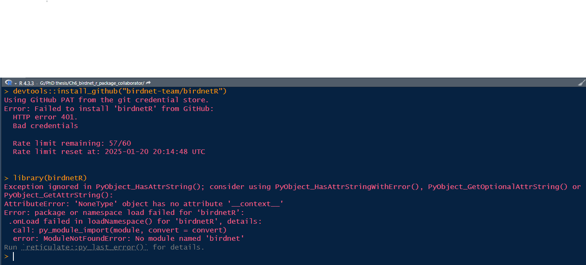

```{r setup, include=FALSE}
knitr::opts_chunk$set(echo = TRUE)
```

### 2025 Jan. 15 - Meeting

Time/location: 8 am (Vancouver) - 5 pm (Chemnitz), on zoom

Who attended: Stefan, Felix, Sunny

#### Accommodation

-   Time period needs accommodation: mid-May to late July

-   There is a council meeting in Cornell on May 15, 16 that Sunny could consider attending and fly to Europe after that

-   Stefan will contact Benny Liebold from the international office to seek for resources and get Sunny on-board ([link](https://www.tu-chemnitz.de/international/forschende/index.php.en))

-   Accommodation searching criteria: furnished, locaiton doesn't matter too much, \~ 500 euro would be good

#### Project

-   The primary focus of the visiting scholar is the R package development

-   Question: What do ecologists expect the R package to do (i.e., functionality to be included in the R package)?

-   Question: When to publish the R package on CRAN? Now the package is still unstable as it's closely linked to the Python package, and can be easily broken if the python package is changing. But it's possible to do it before May even if it's still not perfect.

#### To do

-   Action: Send invitation to the next meeting (Feb.20 8 am Vancouver time)

-   Check the current status of BirdNET R package, understand the functionality that it currently provides

-   Summarize the current workflow that ecologists use for acoustic data (based on my experience, my publication, and the literature review)

-   Design a survey to reach out ecologists who wants to use BirdNET R package and their expectations

### 2025 Jan. 20 - Discussion

#### Workflow commonly used by ecologists for acoustic data analysis & proposed functions for `birdnetR` package

Ecologists often follow a structured workflow for processing and analyzing acoustic data. This workflow is well summarized in the 2019 review paper *"[Emerging Opportunities and Challenges for Passive Acoustics in Ecological Assessment and Monitoring](https://besjournals.onlinelibrary.wiley.com/doi/full/10.1111/2041-210X.13101)"*. BirdNET has been transformative in facilitating the transition from stage **(c) Audio data** to stage **(e) species detection record**:


Based on my experience [studying owl calls using BirdNET](https://ace-eco.org/vol19/iss1/art23/) and discussions with other ecologists, the following core functionalities would be the most valuable for integration into the R package:

1.  **`birdnet_analyze(i, o, min_conf, ...)`**: Auido analysis, specifies input audio files (`i`) and output paths (`o`) for storing detection results. Mirrors the arguments used in the command-line interface (CLI) section for `analyzer.py`.

2.  **`birdnet_train(i, o, ...)`**: Custom model training, enables users to specify training audio files (`i`) and output paths (`o`) for generating customized models. Mirrors the arguments used in `train.py`, facilitating model fine-tuning for specific research needs.

To validate/visualize the detection output from BirdNET, the following functionality will be useful. These are inspired by Wood & Kahl (2024) and by the workflow in my paper (currently under review), which focuses on validating BirdNET detections for setting confidence thresholds:

1.  **`birdnet_species(...)`**: species information, retrieves a list of species given latitude and longitude.

2.  **`birdnet_segments(...)`**: randomly selects segments from detection outputs for validation purposes.

3.  **`birdnet_validation_shiny()`**: interactive validation interface. Provides a Shiny-based interface for visual and audio validation of BirdNET outputs. This interface has been successfully used by many of my colleagues, and I’d be happy to demonstrate it during our next meeting!

4.  **`birdnet_visualization()`**: generates visualizations of detection distributions across time or space.

5.  ...

#### Approaches for developing the `birdnetR` package

I have been exploring the structure of the BirdNET Analyzer project on GitHub, including its Python codebase, Python package, GUI, and other components (such a huge project!). My previous experience includes running BirdNET through the CLI on a Windows system (following the section 6.4. instructions) and the BirdNET GUI. After the reading, I have some questions in terms of different approaches in terms of developing an R package for BirdNET algorithm:

1.  An R package to send CLI commend to BirdNET?

    The R package would construct and execute CLI commands for BirdNET. Users would need to install the BirdNET Analyzer executable (`BirdNET-Analyzer-setup.exe`) beforehand. I made this toy R function [`birdnet_analyze()`](https://github.com/SunnyTseng/Ch6_birdnet_r_package_collaborator/blob/main/R/Ch6_run_BirdNET_in_R.R) for demonstration. This function could take arguments such as `i` (input file) and `o` (output path) to process audio files via BirdNET CLI. Similarly, a `birdnet_train()` function could be developed using the same approach.

    This approach is very straightforward (for me, as an ecologist who use R heavily), without python dependencies. Other R packages, such as one by the [US National Parks Service](https://github.com/nationalparkservice/NSNSDAcoustics?tab=readme-ov-file#running-birdnet-from-rstudio), have successfully employed this method. Maybe I missed something and things are more complicated under the hood. Can you remind me what might be disadvantage/limitation of this method?

2.  An R package to wrap around Python scripts (not the Python package)

    The R package would directly execute Python scripts from BirdNET, such as `analyzer.py`, `embeddings.py`, and `train.py`. This would require users to install BirdNET and Python but avoids depending on the BirdNET Python package itself. This approach could avoids direct dependence on the BirdNET Python package, reducing the risks if the Python package changes, and offers more flexibility than the CLI approach.

3.  An R package to wrap around the python package

    The R package would use `reticulate` to interact directly with the BirdNET Python package. This is the approach we are currently using. While this approach provides the most comprehensive functionality, it also introduces significant complexity in terms of setup and compatibility. It requires users to install Python and manage its environment, and there might be compatibility issues between R, `reticulate`, and the BirdNET Python package.

    PS. I tested the current version of `birdnetR` this morning, both locally and on Posit Cloud. Unfortunately, I encountered errors in both environments and could not get the package to work:

    

-   **Which approach aligns best with our goals?** Should we prioritize ease of use for ecologists (CLI) or maximize functionality (Python package)?

-   **Can the CLI method (or the Python scripts method) provide the core functionality?** If the the core functionality can be provided using simpler approaches, we can always develop other functions easily using R.
