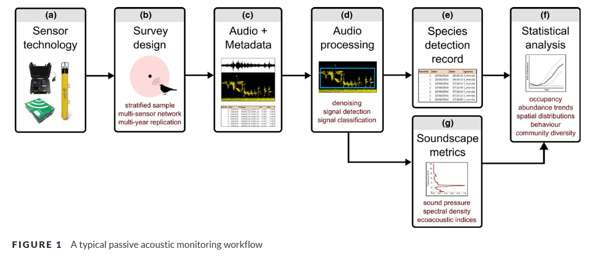

```{r setup, include=FALSE}
knitr::opts_chunk$set(echo = TRUE)
```

### 2025 Jan. 15

Time/location: 8 am (Vancouver) - 5 pm (Chemnitz), on zoom

Who attended: Stefan, Felix, Sunny

#### Accommodation

-   Time period needs accommodation: mid-May to late July

-   There is a council meeting in Cornell on May 15, 16 that Sunny could consider attending and fly to Europe after that

-   Stefan will contact Benny Liebold from the international office to seek for resources and get Sunny on-board ([link](https://www.tu-chemnitz.de/international/forschende/index.php.en))

-   Accommodation searching criteria: furnished, locaiton doesn't matter too much, \~ 500 euro would be good

#### Project

-   The primary focus of the visiting scholar is the R package development

-   Question: What do ecologists expect the R package to do (i.e., functionality to be included in the R package)?

-   Question: When to publish the R package on CRAN? Now the package is still unstable as it's closely linked to the Python package, and can be easily broken if the python package is changing. But it's possible to do it before May even if it's still not perfect.

#### To do

-   Action: Send invitation to the next meeting (Feb.20 8 am Vancouver time)

-   Check the current status of BirdNET R package, understand the functionality that it currently provides

-   Summarize the current workflow that ecologists use for acoustic data (based on my experience, my publication, and the literature review)

-   Design a survey to reach out ecologists who wants to use BirdNET R package and their expectations

#### Workflow that ecologists usually use? What kind of functionality that birdnetR package can provide?

A general workflow that ecologists often use for acoustic data is well summarized in this review paper in 2019: [Emerging opportunities and challenges for passive acoustics in ecological assessment and monitoring](https://besjournals.onlinelibrary.wiley.com/doi/full/10.1111/2041-210X.13101). BirdNET is making a significant contribution from stage (d) to (e).



From my experience in [studying owl calls using BirdNET](https://ace-eco.org/vol19/iss1/art23/) (and from the chat with other ecologists), here are the core functionality that would be the most useful to have in the R package:

-   birdnet_analyze(): single file or multiple file

-   birdnet_train()

To further check how to go from stage (d) to (e), I have a paper that is currently under review, demonstrating how to validate BirdNET detections to get confidence thresholds. Based on the workflow proposed in that paper, here are other useful functions:

-   birdnet_species()
-   birdnet_segments()
-   birdnet_validation_shiny()
-   ...

#### Make the R package to wrap BirdNET Analyzer python code instead of the python package?

Maybe I missed the advantages of wrapping the python package using R? The benefit of wrapping directly the python code would are:

-   to enhance the indepandency (to reduce the complexity of the structure)

-   avoid the troubles of using `reticulate` package, which can be causing issues during the CRAN review, virtual environment, etc.

-   already have successful example runing BirdNET using R ([NSNSDAcoustics](https://github.com/nationalparkservice/NSNSDAcoustics), [Elas's script](https://github.com/eliasb03/teamshrub_bowman_honours/blob/main/scripts/aru_analysis/01_birdNET_functions_v2.R)). And we simply needs to make it into a stable package.
